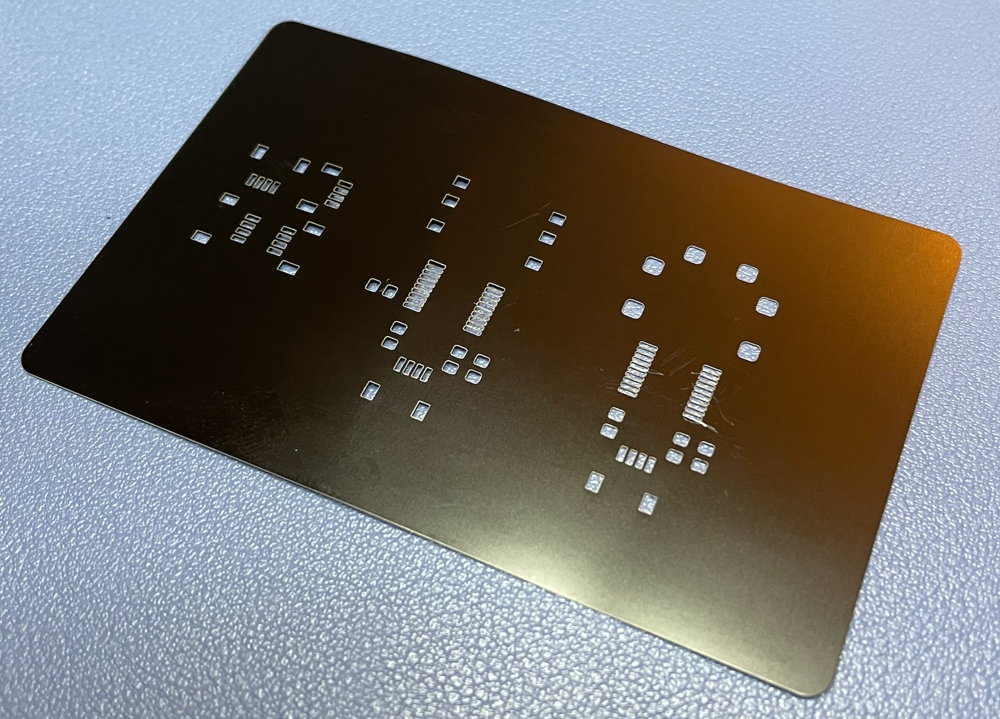
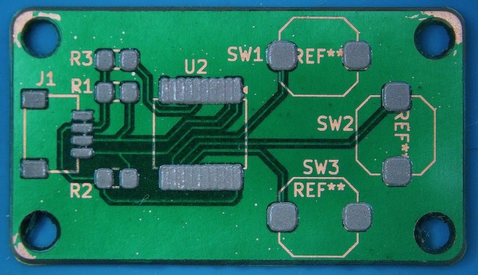

Full Metal Stencil
---
Use a fiber laser to convert clean aluminum business cards into PCB stencils quickly. 

I've used mylar and brass for PCB stencils. I've dialed-in settings with CNC and CO2 lasers. They all work, but this method yields faster, more reliable and higher quality results than my previous combinations.

The downside? Fiber lasers are still relatively expensive.

Why metal business cards? 

* inexpensive ( $0.15 each ) 
* just the right thickness ( 0.8mm )
* stay flat ( brass rolls flip up )
* most of my PCBs are breakouts are small
* they look good 

Video
===
** Click Image to Watch **

Materials
===
|                 Item                                    | Price | Source |
|:-------------------------------------------------------:|:-----:|:------:|
| [Black Metal Business Cards](https://amzn.to/4iVwLtZ)      | 15  | Amazon |
| [xTool F1 Ultra 20W Fiber](https://amzn.to/41h2cZH)      | 4200  | Amazon |
| [Andonstar AD246S-M Digital Microscope](https://amzn.to/41iweML) | 140  | Amazon |
| [MHP50](https://amzn.to/4gItVXV)                         | 140   | Amazon |
| [10 Pcs Single Sided Copper Clad PCB](https://amzn.to/4jXkF4V) | 7     | Amazon |
| [Low Temp Solder Paste](https://amzn.to/42WLXSY)         | 21    | Amazon |
| [Brass 0.1mm Stencil Material](https://amzn.to/42XMIes)  | 10    | Amazon |
| [Gloves Anti-Static](https://amzn.to/3X36cKU)            | 17     | Amazon |
| [PCB Stencil Jig Knobs](https://amzn.to/42TYsPh)         | 10    | Amazon |
| [PCB Stencil Jig Feet](https://amzn.to/4i0Jrzc)           | 10    | Amazon |
| [PCB Stencil Jig Knurled Nuts](https://amzn.to/3X5jerg)    | 10    | Amazon |

Laser Settings
===
| Power | Speed | Pass
|:---:|:---:|:---:|
| 80 | 600 | 220|

Example PCBs
===
I've used this stencil technique on these four different PCBs. Some are featured in the video for reference.

* [micro-chorder](https://github.com/mikeysklar/micro-chorder) - One handed chording keyboard which combines 4 I2C boards
* [old-softie](https://github.com/mikeysklar/old-softie) -  3 soft silicon buttons I2C STEMMA
* [5wayjoy](https://github.com/mikeysklar/5wayjoy) - 5 way tactile joystick I2C STEMMA
* [qthub](https://github.com/mikeysklar/qthub) - 4 way multidirectional hub I2C STEMMA

Acknowledgements
===
Special thanks to both of these excellent folks for sharing their open hardware designs in this area.

* [Stephen Hawes Fiber Laser PCB Fab](https://github.com/sphawes/fiber-laser-pcb-fab)
* [makermoekoe StencilJig3D](https://github.com/makermoekoe/StencilJig3D/tree/main)
